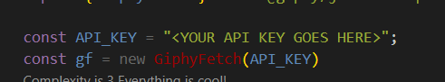
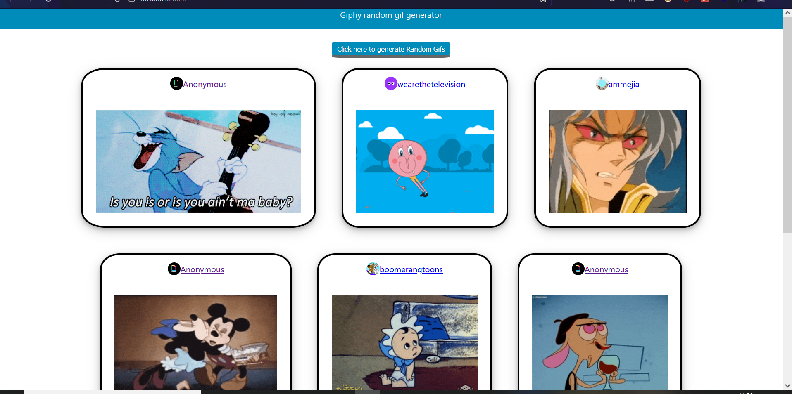

# Giphy random gif generator
This project is part of a challenge for the frontend dev position at [itlookssimple.com](https://www.itlookssimple.com/) 

## Description
This simple web app generate random 10 gifs using the Ghipy API. 

## Set up

1. Clone the repositorie by using git.
2. Get an API key at [Giphy developers](https://developers.giphy.com/docs/sdk).
3. open the src/useGifs.js file and add your API KEY to the API_KEY variable  
   1. 

4. Install the dependencies
   1. `yarn install`

5. start the dev server 
   1. `yarn start`

6. visit [http:localhost:3000](http:localhost:3000/)

a screenshot of the web app can be shown below. 

A deployed version can be visited in the following [link](https://sharp-sinoussi-3601ec.netlify.app/)